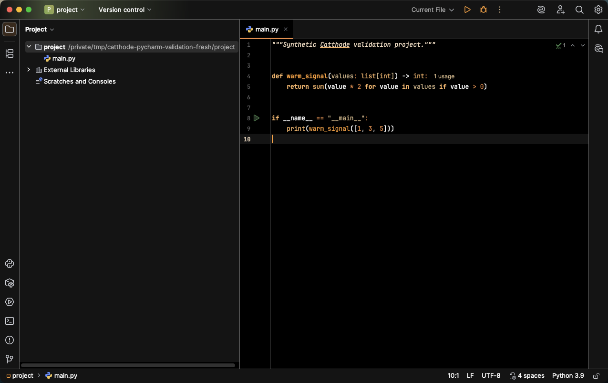

# Catthode for JetBrains IDEs

> **From CRT to OLED.** Bringing warmth back to a world of cold themes. [cattho.de](https://cattho.de/)

Catthode provides a coordinated UI and editor theme for IntelliJ IDEA, PyCharm, WebStorm, GoLand, Rider, Android Studio, and other compatible JetBrains IDEs.

The editor scheme includes broad language, terminal, diff, inspection, version-control, and semantic-highlight coverage, authored for Catthode's warm palette.

## Preview



The preview uses a synthetic project and contains no personal project or account data. The same image is ready to use as Marketplace media.

## Local installation

1. Download `catthode-jetbrains-0.1.1.jar` from `dist/` or the latest GitHub release.
2. Open **Settings → Plugins**.
3. Open the gear menu and select **Install Plugin from Disk…**.
4. Choose the downloaded JAR and restart the IDE when prompted.
5. Select **Catthode** under **Settings → Appearance & Behavior → Appearance**.

## Build

Only the standard `zip` command is required:

```bash
./build.sh
```

The locally installable plugin is written to `dist/`.

## Marketplace

The same JAR is prepared for JetBrains Marketplace submission after local validation in PyCharm Community. The listing metadata, 40×40 plugin icon, source link, license, and Marketplace-sized preview are included in this repository.

For the first upload, sign in to [JetBrains Marketplace](https://plugins.jetbrains.com/), choose **Upload plugin**, select the built JAR from `dist/`, and use the theme category. Verify compatibility with the target IDE versions before publishing.

## License

MIT. The Marketplace EULA is in [EULA.md](EULA.md), and the upload fields are collected in [MARKETPLACE_SUBMISSION.md](MARKETPLACE_SUBMISSION.md).
